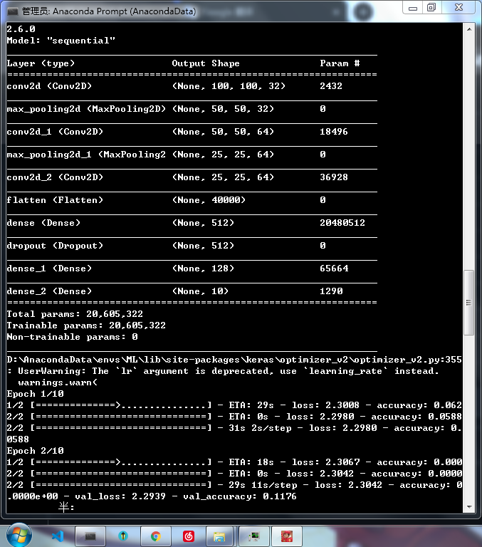

# TF_Opencv2_Gesture_recognition
一个基于tensorflow2.6.0和OpenCV2的手势识别(自制数据集)

## 数据集

-- 有关于这个数据集目前我只是搞了一小部分，过后我将会不断添加。
-- 数据集的每张图片都已经标好序号请切勿打乱
-- 数据集的图片采用的是150 x 150的分辨率
-- 声明：图片以及数据集的代码均为本人原创
### 食用方法
1. 使用python运行train.py
2. 再运行model,py
3. 其次运行cv.py启动实时识别
4. 如果结果不准确可以考虑代码中的epochs的次数(建议：100)

 安装TF` pip install tensorflow `
 
 ##### 新！！
 本次将所有功能集结到同一个py中！！

##### 训练截图

###### 鸣谢
感谢各位大佬们的支持，本人是个高中生在写代码时难免会有些错误还望大家多多支持并在issues里发表意见
我会认真改进！！
也希望给个Star
支持一下呗~ [/比心]
